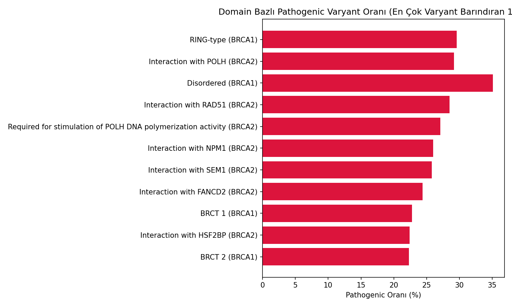
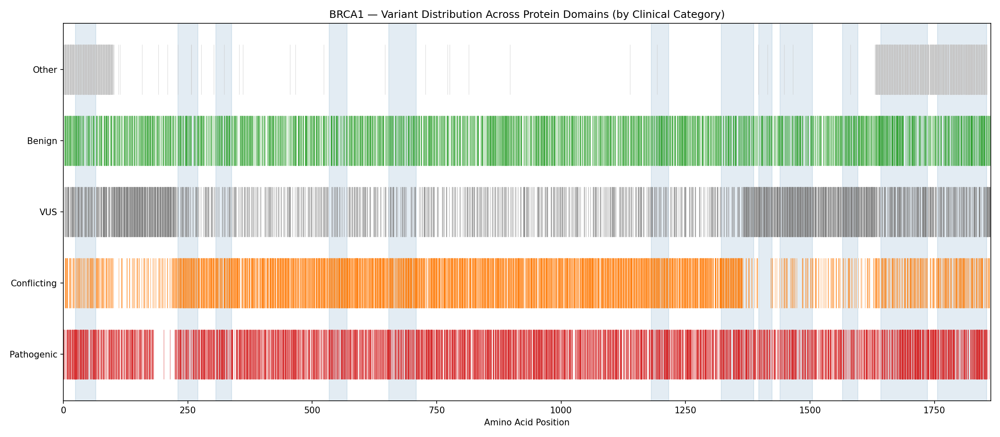

# BRCA1/BRCA2 Variant Analysis Pipeline

BRCA1 ve BRCA2 genlerindeki genetik varyantları analiz eden, uçtan uca bir bioinformatik pipeline'ı. ClinVar'dan gerçek klinik varyant verisini alıp, protein domain'lerine eşleştirerek, hangi bölgelerdeki mutasyonların kanser riskiyle daha güçlü ilişkili olduğunu araştırıyor.

## Ne Yapıyor?

1. NCBI'dan BRCA1/BRCA2 referans dizilerini indirir, doğrular
2. BLAST ile türler arası evrimsel korunmuşluğu analiz eder
3. Ensembl'den gen-transcript-protein ilişkisini çıkarır
4. ClinVar'dan 37,000+ gerçek klinik varyantı indirip filtreler
5. Her varyantı protein seviyesinde annotate eder (missense/nonsense/frameshift)
6. UniProt domain koordinatlarıyla varyantları eşleştirir
7. İstatistik ve görselleştirme üretir

## Kurulum

```bash
git clone <repo-link>
cd brca-variant-pipeline
pip install -r requirements.txt
```

`.env` dosyası oluştur (NCBI API için gerekli):

```
NCBI_EMAIL=senin_email@example.com
```

## Çalıştırma

```bash
python run_pipeline.py
```

Pipeline, her adımın çıktısını kontrol eder — zaten üretilmiş dosyalar varsa o adımı atlar. Baştan tamamen yeniden çalıştırmak için:

```bash
python run_pipeline.py --force
```

**Not:** İki adım tam otomatik değil:

- **BLAST** (`results/brca*_blast_results.xml`): NCBI'ın programatik API'si güvenilir çalışmadığı için, [blast.ncbi.nlm.nih.gov](https://blast.ncbi.nlm.nih.gov/Blast.cgi) üzerinden manuel çalıştırılıp XML olarak indirilmesi gerekiyor (Protein BLAST, Swissprot veritabanı)
- **ClinVar indirme** (`data/raw/variant_summary.txt.gz`): ~442 MB, ilk çalıştırmada uzun sürebilir

## Ana Bulgular

### 1. BRCA1'in RING Domain'i, Mutasyonlara Karşı Belirgin Şekilde Daha Hassas

RING domain'deki (ubikitin ligaz aktivitesi için kritik bölge, pozisyon 24-65) missense varyantların **%18.9'u** Pathogenic sınıflandırılmışken, domain dışındaki bölgelerde bu oran **%1.1**'e düşüyor — yaklaşık 17 kat fark.



### 2. BRCA2'nin BRC Repeats Bölgesi: Yüksek Korunmuşluk, Düşük Klinik Kesinlik

BLAST analizi, BRC repeats/RAD51 etkileşim bölgesinin (pozisyon 1002-2085) evrimsel olarak en korunmuş bölge olduğunu gösterdi. Ama bu bölgedeki varyantların **Pathogenic oranı sadece %0.25** — çoğu Conflicting/VUS olarak sınıflandırılmış. Bu, bölgenin biyolojik önemine rağmen klinik konsensüsün henüz oluşmadığını gösteriyor.

### 3. Varyant Türü, Tek Başına Güçlü Bir Tahmin Sinyali

| Etki Türü | Pathogenic Oranı |
|---|---|
| Frameshift | %98 |
| Nonsense | %96 |
| Missense | %2 |
| Synonymous | %0.2 |

Missense varyantlar, klinik belirsizliğin ana kaynağı — etkisi domain konumuna bağlı olarak büyük ölçüde değişiyor.



## Proje Yapısı

```
brca-variant-pipeline/
├── data/
│   ├── raw/           # İndirilen ham veriler
│   └── processed/     # İşlenmiş/analiz edilmiş veriler
├── src/                # Her analiz adımının kodu
├── results/            # Görseller ve BLAST sonuçları
├── run_pipeline.py     # Ana çalıştırma script'i
└── requirements.txt
```

## Kullanılan Veri Kaynakları

- [NCBI](https://www.ncbi.nlm.nih.gov/) — Referans DNA/protein dizileri
- [Ensembl](https://www.ensembl.org/) — Gen-transcript-protein ilişkisi
- [UniProt](https://www.uniprot.org/) — Protein domain koordinatları
- [ClinVar](https://www.ncbi.nlm.nih.gov/clinvar/) — Klinik varyant sınıflandırması

## Sınırlamalar

- CNV/büyük yeniden düzenlemeler (large rearrangements) kapsam dışı — bu proje sadece SNV/küçük indel'lere odaklanıyor
- ClinVar'ın "Other" kategorisi (değerlendirilmemiş kayıtlar), şu an VUS'tan ayrıştırılmamış durumda
- Domain yoğunluk istatistikleri tüm etki türlerini birlikte hesaplıyor; domain-spesifik risk için missense-only analiz daha güvenilir bir sinyal

## Teknoloji

Python, Biopython, pandas, matplotlib, requests